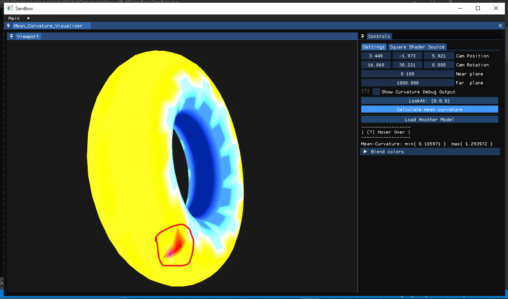

# 1. Introduction

This is my exercise on Mean curvature, based on paper
```
Discrete Differential-Geometry Operators for Triangulated 2-Manifolds
by Mark Meyer, Mathieu Desbrun, Peter Schr¨oder, and Alan H. Barr1
```


(i know it looks awful, but its actually correct (calculations are correct though))
# 2. How to use

## 2.0.1 Dependencies (Included)

- Glad (OpenGL version 4.4 +) > https://glad.dav1d.de/
- glfw > https://github.com/glfw/glfw
- spdlog > https://github.com/gabime/spdlog
- glm > https://github.com/g-truc/glm
- imgui > https://github.com/ocornut/imgui/tree/docking
- stb_image > https://github.com/nothings/stb/blob/master/stb_image.h

## 2.1 Environment

- Visual Studio 2017+ (for C++ 17)
- Windows-10(or equivalent)
- Git
- Premake (included)

## 2.2 Download code

```bash
git clone https://github.com/ishanshLal-tRED/Mean-Curvature-tests  Mean-Curvature-tests
cd Mean-Curvature-tests
```

## 2.3 Compile

1. Build the project
```bash
call Setup-Windows.lnk
```
It'll copy the necessarry files, and set-them up for ya.
Open the solution `Assignment.sln` and build it as normal.
